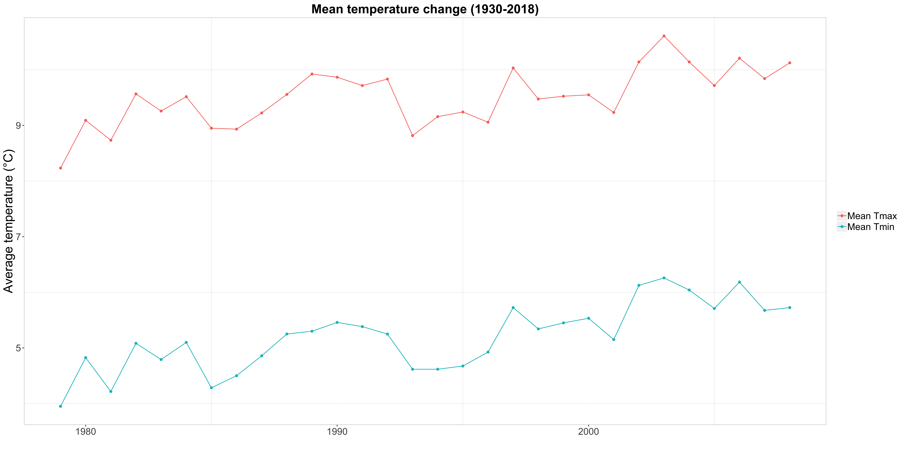

# Appendix(ces)

## Appendix A: additional tables 

```{r open data and libraries, include = F}
library(knitr)  # for dynamic report generation
library(kableExtra) # to build complex HTML or 'LaTex' tables
library(tidyverse) # for data manipulation
puffins_t <- read.csv("../data/puffins_temp.csv")
                      # to open the file puffins_temp.csv

puffins_t <- puffins_t %>%
  rename("Year" = year, "Country list" = Country.list,
         "Population trend" = pop_trend, "ID" = id,
         "Mean max. T (°C)" = mean_tmax, "Mean min. T (°C)" = mean_tmin)  
            # A bit of data transformation! "New name" = Old.name
```

```{r table1, echo=F}
puffins_t %>%
  slice(1:10) %>%   # the table is going to show only the first 10 lines (a sample of the data set)
  kable(digits = 2) %>% # each value has 2 decimal digits
  kable_styling(full_width = F, # the width of the table is not fit to the width of the page
                position = "center", font_size = 10,
                latex_options = "hold_position")  # table settings with the kableExtra package
```	

\newpage

## Appendix B: additional figures

```{r path-to-folder plots fixed size, echo = FALSE, out.height="40%", fig.show='hold', fig.align="center",  fig.cap="Additional images in Appendix B"}

# 
```
\newpage

## Appendix C: code

```{r get-labels, echo = FALSE}
labs = knitr::all_labels() # this is the new code chunk to add
labs = setdiff(labs, c("setup", "get-labels")) # this function excludes the code chunk with the label "setup" from being displayed.
```

```{r all-code, ref.label=labs, eval=FALSE}
# this code chunk displays all source code from your entire dissertation document (that you have written in .Rmd, not from your R script).
```